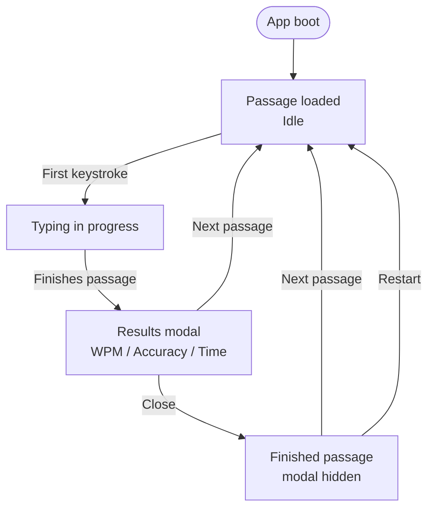
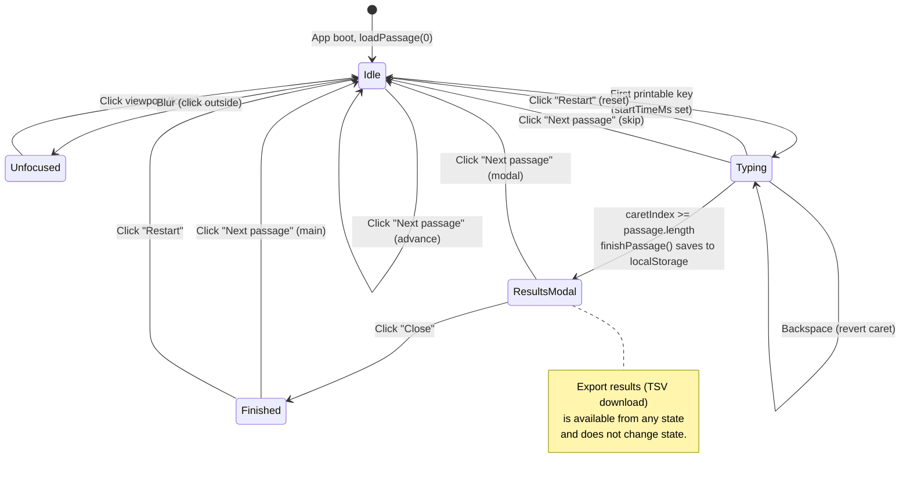

# Typing Game — User Flow

Two diagrams below: a high-level happy-path overview, and a comprehensive state diagram covering every user interaction.

## 1. High-Level Flow

## 2. All User Interactions

## Interaction Reference

| Action | Trigger | Effect |
|--------|---------|--------|
| Type character | Printable keydown | Marks char `done`/`err`; advances caret; starts timer on first key |
| Backspace | `Backspace` keydown | Reverts caret; clears `done`/`err` on prior char |
| Click viewport | Mouse click on typing area | Focuses viewport; dismisses blur hint |
| Restart | "Restart" button | Reloads same passage from index 0 |
| Next passage (main) | "Next passage" button | Cycles to next of 10 passages |
| Next passage (modal) | Modal "Next passage" | Dismisses modal + advances |
| Close modal | Modal "Close" | Hides modal; stays on finished passage |
| Export results | "Export results" button | Downloads TSV of all historical runs |

Source: `game.js` (handlers ~line 294+, `finishPassage` 224–244, `loadPassage` 68–104, export 269–292) and `index.html`.
